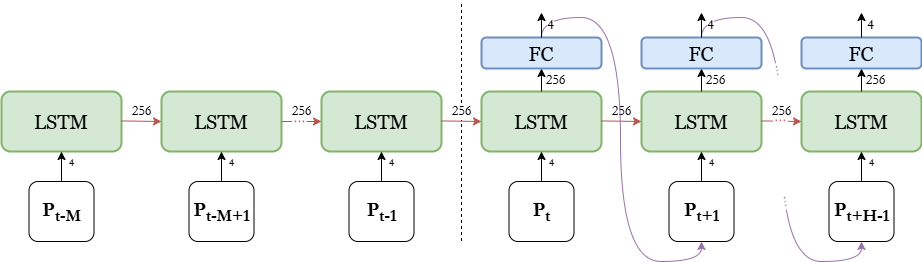

<h1>A Quantitative Study of the Extent to Which Region-of-Interest Can Be Used for Viewpoint Motion Prediction</h1>

This repository contains the code and figures used to undertake research for my final year project at the University of York. This project was completed in partnership with AMD.

This project aims to develop a predictive model utilising frame data to predict
viewpoint motion in video games to enable pre-rendering and delivery of
frames in a cloud gaming scenario. A further aim is to use the predictive
model to reduce encode time by indicating which pixels are likely to remain
in the frame.

Two predictive models were developed, one using image data and one
without to predict viewpoint motion. These were trained on a dataset of
speedruns of the videogame Doom. Additionally, a method to use the
viewpoint motion predictions to assist the video encoder was developed.

The results show that image models have a huge potential to reduce latency
in cloud gaming systems over current methods. They also demonstrate
that predictive models in cloud gaming can also be used to lower data
transmission as an added benefit of implementing predictive rendering.

 

<h2>Baseline Model</h2>

A model trained only using previous motion vectors was created as a baseline and for comparison, where Pt
is the motion vector at the point of prediction and M is the
size of the input window, and H is the size of the prediction window. This
means that the model takes in the M motion vectors previous to the frame,
and outputs H motion vector predictions.

</img>
The model was based on LSTMs and uses a seq2seq architecture. A
seq2seq architecture consists of an encoder and a decoder. The M input
motion vectors are input to the encoder, which generates and maintains
a representation that is passed to the decoder, which predicts H motion
vector predictions, which it does by making one prediction at a time that is
fed back as input for the next prediction.

<h2>Multimodal Model</h2>

The main model takes 3 types of input: previous motion vector, semantic
segmentation map, and depth map.

The seq2seq approach is taken again, with the encoder taking all 3 types of
input, and the decoder making predictions using the hidden state, and the
predicted motion vector for the frame before. This is represented in Figure
3.3, where St
is the semantic segmentation map at the point of prediction
and Dt
is the depth map.

</img>
<b>Encoder</b>
<ul>
<li><b>Content LSTM</b> - The semantic segmentation map and depth map are
processed by convolution layers before being concatenated and passed into
the content LSTM, which has a hidden size of 256. This LSTM maintains a
hidden state representing the content of the frames in the input window.</li>

<li><b>Inertia LSTM</b> - The previous motion data is processed by a fully connected
layer before being passed to the inertia LSTM, with a hidden size of 256.
This LSTM maintains a hidden state representing the movement of the
player over the input window.</li>

<li><b>Fusion LSTM</b> - The output of the content and inertia LSTMs are concatenated and input into the Fusion LSTM, which has a hidden size of 256. The
goal of this LSTM is to fuse the outputs of the 2 LSTMs in a helpful way.</li>
</ul>
<b>Decoder</b>

The decoder consists of the same components as the encoder but with
different weights. Each of the components receives the hidden state from
the encoder of the corresponding component. Here, however, the visual
LSTM receives a masked input reflecting the lack of knowledge of the next
frame. The output of the decoder is re-injected as the motion vector input
for the next prediction.

<h2>Encoding</h2>
Viewpoint motion predictions, as output from the predictive models above,
can be used to determine which pixels are likely to remain in a frame. This
can be used to assist the video encoder by indicating which regions should
be compressed less.
A method to derive a heatmap to assist the encoder utilising the motion
vector predictions was developed. The depth map for a frame was used to
generate a point cloud, representing each pixel visible in the frame in 3D
coordinates. A transformation and rotation equivalent to the predicted motion vector was
then applied to the point cloud, and the points were reprojected.

</img>

By predicting motion vectors for the next n frames in the prediction window, n heatmaps can be combined. This was done by normalising each heatmap (0.0-1.0), then applying a Gaussian blur. This was done to create
natural gradients, preventing encoding artifacts. The heatmaps were then
combined according to a weighting scheme: front-heavy, back-heavy, or
linear.

</img>
By passing these heatmaps to the encoder as QP maps, the encoder can
dynamically adjust Quantization Parameters across regions of the frame.
Smaller QP values are assigned to important regions, and larger QP values
are assigned to less relevant regions. This helps the encoder to ensure
important areas are at a higher quality, while less important areas can be
compressed more.

<h2>Results</h2>
<h3>MSE Loss</h3>
<image src=""></image>
The graph plots the MSE loss as the prediction window increases for the
combined image and motion model, the previous motion-only model, and
also a model that predicts the last movement as the next movement. We
can see that both of the predictive models are much more accurate than
predicting the last input, reducing the MSE loss from ~3750 to under 2000.

<image src="loss_no_input_prediction.png"></image>

Plotting just the 2 predictive models, as done here, shows interesting results. This was measured further for a predictive window of 20
frames. The image model shows an upwards trend - this makes sense, as
the model predicts further into the future, its predictions will most likely get
less accurate.
Interestingly, this does not stay the same for the motion model - its loss
starts higher, then decreases before increasing at a slower rate than the
loss of the image model, eventually beating the image model at the 7th
frame (~200ms RTT).
These results show that the image model outperforms the motion only
model for a short predictive window (0-200ms), whereas when predicting
for a longer window (200-571ms)the motion only model performs best.

However, as RTT in cloud gaming systems does not typically exceed 200ms,
we can see that in a cloud gaming scenario, the predictions from the image
model are more accurate.

<h3>Percentage Error</h3>
The percentage error of each metric (X, Y, Z, Angle) for each frame predicted in a length 20 prediction window was calculated for the baseline
and image model. The percentage error is based on how far the user
could potentially move in a direction in 1 frame - if the prediction predicts a
movement of 0, but the player moves as far as possible in 1 frame, it results
in a percentage error of 100%.

<image src="percentage_error_x.png"></image>
<image src="percentage_error_y.png"></image>

The X and Y metrics display similar trends, with the image model starting at
a lower error than the baseline model, but increasing at a faster rate, with
the baseline model beating the image model at frame 14 for the X metric,
and at frame 8 for the Y metric. The percentage error for a RTT of 171ms
(6 frame window) varies between 10-15% for both metrics in the image
model, and between 15-16% for the baseline model. For these metrics,
the image model is preferable for the RTT encountered in real-world cloud
gaming systems.

<image src="percentage_error_z.png"></image>

The Z metric shows a different trend, where the baseline model beats
the image model for predictions below 5 frames (143ms), with the image
model then reducing error and beating the baseline model. However, the
percentage error for both models is very low during the whole prediction
window, only varying between 4.14-4.29%. The image model is likely better
at predicting for longer periods due to being able to see changes in floor
height, which could also worsen it’s earlier predictions, where the nearby
change in floor height isn’t likely to have affected the player’s position yet.

<image src="percentage_error_angle.png"></image>

The Angle metric shows very high percentage errors for both models, which
then drops off and plateaus at ~50% for both models at around frame 7
(200ms). Before this, the image models comes in considerably lower than
the baseline model, having a minimum value of 24.58%, compared to a
minimum value of 45.64% for the baseline model. The inaccuracy in angle
can be resolved by rendering a cube map, which can cover all 360 degrees.
Predicting variance in addition to an angle prediction can be used to render
a smaller portion of this cube map, called a clipped cube map.

<h3>Inference Time</h3>

The inference time of the 2 models was also measured, with the inference
time of the image model being 24.25ms, and the baseline model being
6.57ms. This means that the baseline model has an advantage of 17.68ms
over the image model. However we can see that the image model outperforms the baseline model even including this. Outatime [1] found that their
predictive model (using motion only) could be used to mask up to 120ms
RTT. Although they used a different predictive model, if we assume that
when implemented in a real system our baseline model can mask a similar
RTT, this corresponds to a prediction of about 4.25 frames into the future.
The difference in inference time means that the image model would have
to predict another 0.6 frames into the future, so we need to compare if the
image model prediction at ~4.85 frames beats the baseline model at 4.25
frames. We can see that this is the case for MSE, and percentage error for
all metrics apart from the Z metric. The image model at the 6th frame still
remains below the MSE of the baseline model at 4.25 frames, indicating
that the image model could be used to potentially mask a RTT of 171ms, a
reasonable increase from the 120ms previously achieved in Outatime.

<h2>Encoding Metrics</h2>

<h3>VMAF</h3>
VMAF uses predicts subjective video quality by modeling human perception
of video quality. This metric fits our use case and enables us to compare
the VMAF between the different encoding methods. VMAF is represented
as a score between 0 and 100. 

<image src="h264_vmaf.png"></image>
<image src="h265_vmaf.png"></image>
<image src="av1_vmaf.png"></image>

These show that both the image and baseline model improve the quality of
the frame over the vanilla encode. The image model beats both, which is
a strong indicator of the success of assisting the encoder with heatmaps
generated from the viewpoint movement predictions. This also indicates
that the predictive model is predicting well and is fit for purpose.

<h2>Conclusion</h2>
A multimodal model has been successfully created and trained that takes
in a combination of image and past movement data to predict viewpoint
motion. This has demonstrably been shown to beat a motion-only approach
across Mean Squared Error and Percentage Error. The performance of the
model strongly suggests it could be used to mask a higher latency of up to
171ms in cloud gaming systems, representing a 51ms increase.

A method to use viewpoint predictions to assist the video encoder was
developed, and the viewpoint predictions of the image model were found to
improve the quality of the frames output, as measured through VMAF.

To read the full paper click <a href="">here</a>
